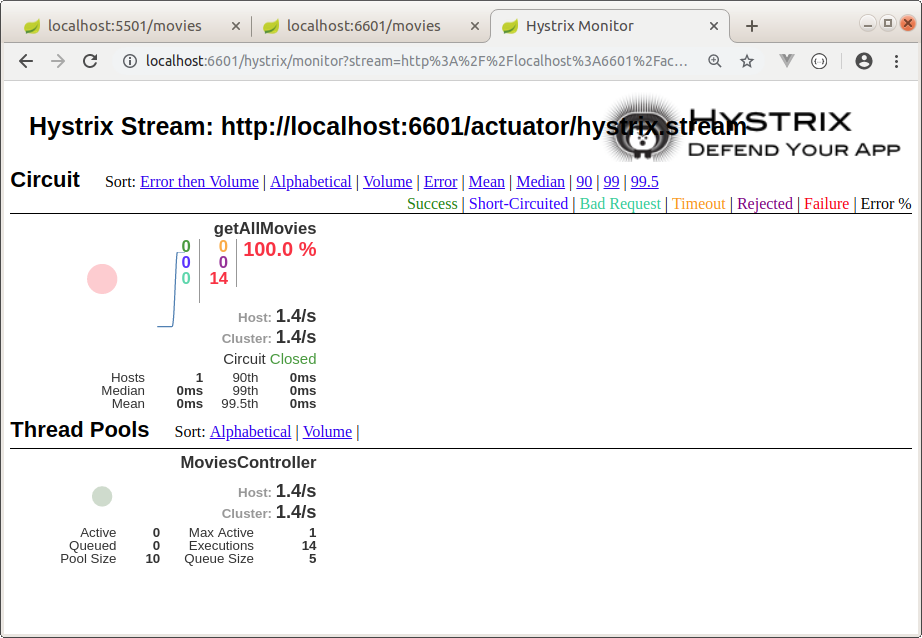

HYSTRIX EXAMPLE WITH SPRING CLOUD
--------------------------------------------------------------------------------------------------------------------

Microservicios de ejemplo, desarrollados con Spring Boot y Spring Cloud.
Se construye servicio cliente que recupera informacion de peliculas desde servicio movie-info-service.

En caso de que el servicio proveedor de peliculas se encuentre abajo o no responda adecuadamente,
se genera un retorno por defecto, llamando a un metodo "fallback".

--------------------------------------------------------------------------------------------------------------------

Se levanta servicio proveedor "movie-info-service" en el puerto 5501:


--------------------------------------------------------------------------------------------------------------------

Se levanta servicio cliente en el puerto 6601, que recupera la informacion
obtenida desde el servicio proveedor de peliculas:


--------------------------------------------------------------------------------------------------------------------

Si el servicio proveedor de peliculas no responde, se utiliza estrategia de fallback
gatillando una llamada al metodo getDefaultMoviesList.


--------------------------------------------------------------------------------------------------------------------

Retorno generado por metodo fallback getDefaultMoviesList:


--------------------------------------------------------------------------------------------------------------------

En el archivo de propiedades, se habilita endpoint para utilizar Hystrix Dashboard:

```
management.endpoints.web.exposure.include=hystrix.stream

```

--------------------------------------------------------------------------------------------------------------------

Pantalla inicial del Hystrix Dashboard:


 

--------------------------------------------------------------------------------------------------------------------

Monitoreo del servicio cliente con Hystrix Dahsboard:



--------------------------------------------------------------------------------------------------------------------


