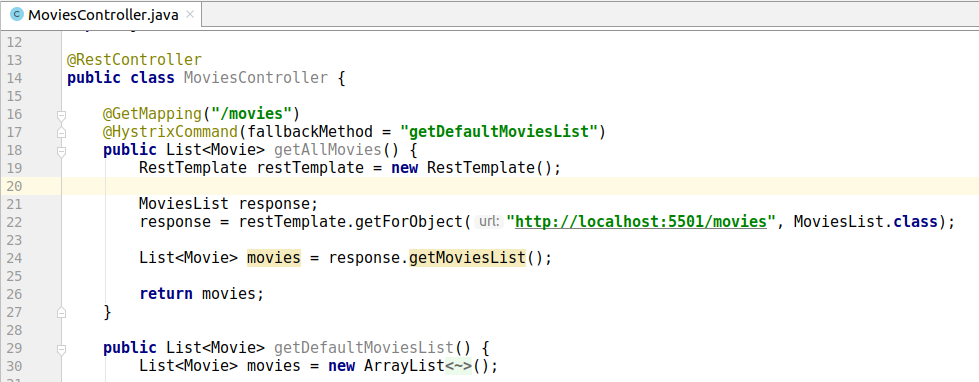

HYSTRIX EXAMPLE WITH SPRING CLOUD
--------------------------------------------------------------------------------------------------------------------

Microservicios de ejemplo, desarrollados con Spring Boot y Spring Cloud, 
en que se muestra el uso del Circuit Breaker Hystrix.

Se construye servicio que recupera información de películas desde servicio movie-info-service.
En caso de que el servicio de películas se encuentre abajo o no responda adecuadamente,
se genera un retorno por defecto, llamando a un metodo "fallback".

--------------------------------------------------------------------------------------------------------------------

**Servicio de películas**

Este servicio contiene un controller Rest que retorna un listado de películas.

**Archivo de propiedades**

En el archivo application.properties se indica que este servicio se levanta en el puerto 5501.


**Ejecución**

Se levanta servicio "movie-info-service" en el puerto 5501:


--------------------------------------------------------------------------------------------------------------------

**Servicio Hystrix**

**Dependencias**

Para acceder a las funcionalidades del Circuit Breaker, 
se utiliza la dependencia "spring-cloud-starter-netflix-hystrix".

```
  <dependency>
    <groupId>org.springframework.cloud</groupId>
    <artifactId>spring-cloud-starter-netflix-hystrix</artifactId>
  </dependency>

```

**Archivo de propiedades**

En el archivo application.properties se configura el puerto 6601.

```
  server.port=6601

```

**Anotaciones**

La anotación @EnableCircuitBreaker permite que el servicio actue como un Circuit Breaker.

```

@SpringBootApplication
@EnableCircuitBreaker
public class HystrixExampleApplication {

	public static void main(String[] args) {
		SpringApplication.run(HystrixExampleApplication.class, args);
	}

}

```

**Ejecución**

Se levanta servicio en el puerto 6601, que recupera la informacion
obtenida desde el servicio de peliculas:


Si el servicio de peliculas no responde, se utiliza estrategia de fallback
gatillando una llamada al metodo getDefaultMoviesList.



Retorno generado por metodo fallback getDefaultMoviesList:


--------------------------------------------------------------------------------------------------------------------


